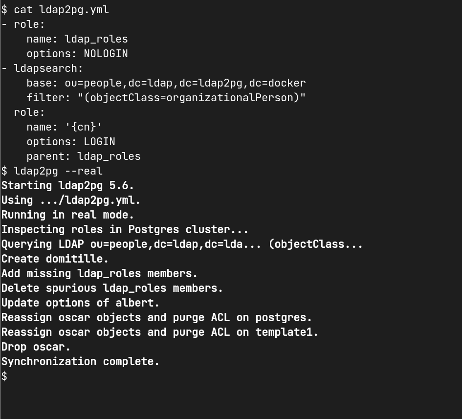

<h1><code>ldap2pg</code></h1>

`ldap2pg` is a simple yet powerful tool to synchronize Postgres roles and ACLs
from LDAP directories, including OpenLDAP and Active Directory.

Project goals include **stability**, **portability**, high **configurability**,
state of the art code **quality** and nice **user experience**.




## Highlighted features

- Configure multiples LDAP queries.
- Customize Postgres role options (`LOGIN`, `SUPERUSER`, `REPLICATION`, etc.).
- Create, alter and drop roles.
- Manage role members.
- Grant or revoke ACLs per database and/or per schema.
- Dry run to audit a cluster.


## Quick installation

Just use PyPI as any regular Python project:

``` console
# apt install -y libldap2-dev libsasl2-dev
# pip3 install ldap2pg
# ldap2pg --help
```

Now you **must** configure Postgres and LDAP connexions as well as the
synchronization map.
The
[dumb but tested `ldap2pg.yml`](https://github.com/dalibo/ldap2pg/blob/master/ldap2pg.yml) is
a good way to start.

``` console
# curl -LO https://github.com/dalibo/ldap2pg/raw/master/ldap2pg.yml
# editor ldap2pg.yml
```

Finally, it's up to you to use `ldap2pg` in a crontab or a playbook. Have fun !
